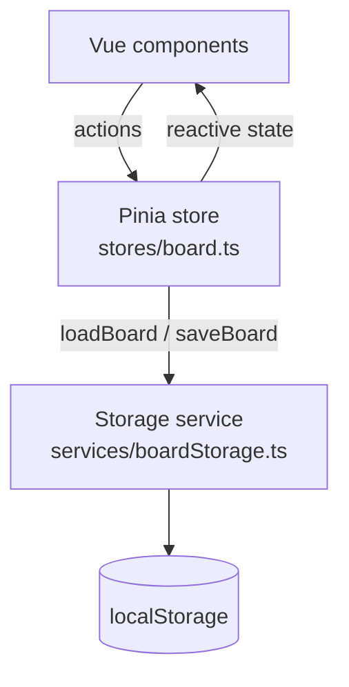

# Kanban Board - Front-end Tech Watch (Vue.js)

A Kanban application built with **Vue 3** as part of a front-end technology watch (Vue / Angular / React).
The Kanban is a testing ground: it lets us assess the technology on a concrete use case.

> The tech watch report (comparison of the 3 technologies and justification of the choice) is available in `rapport-veille-front.pdf`.

---

## Features

| Feature | Status |
|---|---|
| Add columns | ✅ |
| Add tasks to a column | ✅ |
| Edit a task's title and description (description empty on creation) | ✅ |
| Delete a task (with confirmation) | ✅ |
| Data persistence across reloads (localStorage) | ✅ |
| Print styles | ✅ |
| Move tasks (drag & drop) | ❌ Dropped (see "Prioritization") |

---

## Requirements

- **Node.js 22.18+ or 24.12+** (`engines` field in `package.json`)
- npm

## Installation

```bash
git clone https://github.com/Abakar-Issa-Ali/veille-techno-frontend.git
cd veille-techno-frontend
npm install
npm run dev
```

The app is available at `http://localhost:5173`.

## Scripts

| Command | Purpose |
|---|---|
| `npm run dev` | Development server with hot reload |
| `npm run build` | Type check + production build into `dist/` |
| `npm run preview` | Serves `dist/` locally (use it for Lighthouse / EcoIndex measurements) |
| `npm run type-check` | TypeScript type checking (vue-tsc) |
| `npm run lint` | Static analysis (Oxlint then ESLint, with auto-fix) |
| `npm run format` | Formatting with Prettier |

> ⚠️ `npm run preview` serves `dist/` as is: run `npm run build` again after every change.

---

## Stack and dependencies

| Package | Type | Justification |
|---|---|---|
| `vue` | production | The framework under evaluation |
| `pinia` | production | Vue's official store: centralizes state and eases debugging (Vue DevTools) |
| `tailwindcss` + `@tailwindcss/vite` | development | Utility-first styles; only the classes actually used are generated (final CSS ≈ 3 KB gzip) |
| `typescript`, `vue-tsc`, `oxlint`, `eslint`, `prettier`… | development | Typing, static analysis and code formatting |

**Only 2 production dependencies.** Several needs are covered by native browser APIs instead of a library:

| Need | Native solution | Library avoided |
|---|---|---|
| Edit modal | `<dialog>` + `showModal()` | modal library |
| Unique identifiers | `crypto.randomUUID()` | `uuid`, `nanoid` |
| Delete confirmation | `confirm()` | dialog library |

---

## Architecture

The app is a **SPA** (Single Page Application) with no backend, organized in three layers:



- **Components**: rendering and user input. They only know the store.
- **Store**: single source of truth. Every data change goes through its actions.
- **Storage service**: the only file aware of localStorage.

**Switching data sources** (e.g. to a REST API) would require changing **a single file**: `services/boardStorage.ts`.

### Component tree

```
App.vue
└── BoardView.vue           reads the store, holds the selected task
    ├── KanbanColumn.vue    renders a column (props) and forwards events
    │   ├── TaskCard.vue    renders a task, emits "open" on click
    │   └── AddTaskForm.vue collapsible form, emits "add"
    ├── AddColumnForm.vue   form, emits "add"
    └── TaskModal.vue       edit / delete a task (native <dialog>)
```

Principle: **data flows down through props, events flow up through `emit`**. Only `BoardView` talks to the store; the other components stay independent and reusable.

### Folder structure

```
src/
├── assets/main.css           Tailwind import
├── components/               Vue components (see tree above)
├── services/boardStorage.ts  localStorage access
├── stores/board.ts           Pinia store (state + actions)
├── types/kanban.ts           TypeScript types
├── App.vue                   main layout
└── main.ts                   entry point (Vue + Pinia)
public/
├── favicon.ico
└── robots.txt
```

---

## Data model

```ts
interface Task {
  id: string          // crypto.randomUUID()
  title: string
  description: string // empty on creation
  createdAt: string   // ISO date
}

interface Column {
  id: string
  title: string
  tasks: Task[]       // tasks are nested inside their column
}
```

The board is stored in localStorage under the `kanban-board` key, as JSON.

**Why localStorage?** The brief does not require a backend. localStorage is enough for single-user use in a single browser, with no server to host or maintain.
Accepted limitations: data is tied to one browser, no sync across devices, about 5 MB maximum.

**Resilience**: if the localStorage content is corrupted, the app starts from an empty board instead of crashing (`try/catch` in `loadBoard`).

---

## Notable technical choices

- **Composition API + `<script setup>`**: the syntax recommended for Vue 3, and the closest to React hooks.
- **Pinia "setup store"**: state is declared with `ref`, and actions are plain functions.
- **Automatic persistence**: a deep `watch` on the state saves on every change.
- **Local draft in the modal**: the task is copied when the modal opens, and the store is only updated on save. "Cancel" or Escape have nothing to undo.
- **UI state outside the store**: the selected task lives in `BoardView`, not in Pinia. The store only holds business data.
- **Security**: no `v-html`. All user input is rendered through `{{ }}` interpolation, which Vue escapes automatically (XSS protection). Input lengths are capped (`maxlength`).
- **Accessibility**: clickable cards are `<button>` elements (keyboard-friendly), labelled form fields, `lang` attribute on `<html>`, Escape closes the modal.

---

## Measurements (production build, `npm run preview`)

| Metric | Result |
|---|---|
| Transferred size (gzip) | ≈ 34 KB (JS 30 KB + CSS 3 KB + HTML) |
| HTTP requests | 3 |
| Lighthouse (Performance / Accessibility / Best Practices / SEO) | 100 / 100 / 100 / 100 |
| EcoIndex (GreenIT-Analysis, cache cleared) | **A — 95** |

The 3 GreenIT best practices not met (cache headers, HTTP/2, print stylesheet detection) depend on the local preview server or on the tool's detection method, not on the application.

---

## Prioritization (MoSCoW)

The backlog is tracked on GitHub Projects (user stories, acceptance criteria, estimated vs. actual time).

- **Must**: the 4 required features, persistence, README, report, presentation.
- **Should**: resilience, accessibility and measurements done; drag & drop **dropped**, as it is not required by the brief and too costly for a 5-day timeframe.
- **Could**: due dates, filters, categories, not done.

---

## Possible improvements

- Moving tasks with drag & drop (native HTML5 API, no dependency)
- Renaming and deleting a column
- Due dates, filters, categories
- Replacing localStorage with a REST API (a single file to change: `services/boardStorage.ts`)